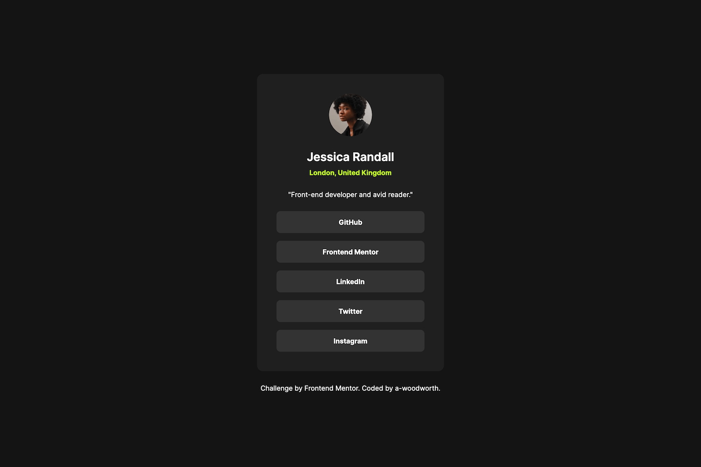
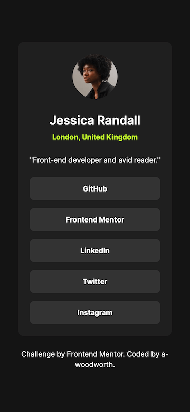

# Frontend Mentor - Social links profile solution

This is a solution to the [Social links profile challenge on Frontend Mentor](https://www.frontendmentor.io/challenges/social-links-profile-UG32l9m6dQ).

## Table of contents

- [Overview](#overview)
  - [The challenge](#the-challenge)
  - [Screenshots](#screenshots)
  - [Links](#links)
  - [Built with](#built-with)

## Overview

### The challenge

Users should be able to:

- See hover and focus states for all interactive elements on the page

### Screenshots

**Desktop**

**Mobile**

### Links

- Solution URL: [Solution]()
- Live Site URL: [Live Site](https://a-woodworth.github.io/social_link_profile)

### Built with

- Semantic HTML5 markup
- CSS Custom properties (variables)
